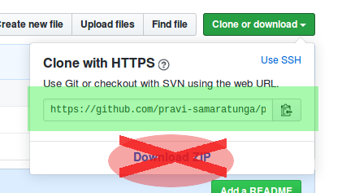

<p align="center"></p>

# Pravi's Git Tutorial

Download this repository by using `git clone`. Do not use the "Download Zip" function in GitHub. In general, you should never ever use that button:



The command you should use is `git clone`. Copy the box highlighted above in green, and add it to the end of `git clone`. For instance:

```
git clone https://github.com/pravi-samaratunga/git_tutorial.git
```

This copies the **git repository** to your computer. A git repository contains the history of the code here. The history is recorded in a folder called `.git`, and it holds the differences between each version of the repository.

The repository versions that are kept track of are called **commits**. Each commit holds a record of the defference between it and the last commit. In general, you should commit as often as you can. Any code that you commit is safe, and can always be recovered as long as you have access to the repository.

It is important to understand that **git** and **GitHub** are not the same thing. GitHub is a website that hosts many git repositories. Git itself is simply a version control system. Git repositories do not depend on GitHub in any way, but it is often convenient to use GitHub as a central server on which to host repositories.

I've marked certain paragraphs with a 🔶. Let me know when you are at these steps. Most of the rest of this tutorial is somewhat more focused on theory, but these are somewhat whimsical exercises. 

## git status, git add, git commit

🔶 Make a folder within the `git_tutorial` folder. Add a file to that folder. Write 3 short lines in that file. It doesn't really matter what else that file contains.

Run `git status` to see the files in the working directory. You'll notice that the file you just added is not shown, because it is inside of a folder.

We need to **add** the new file to the git index, so that git knows that it should keep track of this file:

```
git add path/to/your/file
```

You can run `git status` again to make sure that the right files have been added to the commit. Then finally, you need to commit the changes that have been made.


```
git commit
```

At this point, your terminal's text editor will pop up. Write a description of your file, then save and exit.

If you do not want to use the terminal text editor, you can instead use `git commit -m "<Description of file>"`. That's what I usually do. Commit messages should be short and descriptive, so that you know what you did between this commit and the previous one.

## git remote

Run `git remote -v`. You will see two **remote** addresses for this repository. It should look something like this:

```
origin  git@github.com:pravi-samaratunga/git_tutorial.git (fetch)
origin  git@github.com:pravi-samaratunga/git_tutorial.git (push)
```

This is usually what we want. However, I'm currently a little annoyed with GitHub and do not want to host this code there. Let's host it at Venti's local server instead.

```
git remote set-url origin venti@192.168.1.210:~/git_tutorial.git
```

## git pull and git push

Run the following command:

```
git push -u origin master
```

There's a small chance that you won't get an error. On the other hand, it's pretty likely that you will get an error that says: `error: failed to push some refs`. This *usually* just means that someone else pushed a change to the repository before you did. In order to fix that, run:

```
git pull
```

There will be a **fast-forward merge** (I'll talk about what that means later). The local commits in your repository will be updated, and then you can finally:

```
git push
```

## Branching and merging

I'm not going to go into too much detail in this topic right now. I may expand on it later.

Each local repository is considered a **branch**. You can set up individual branches on your local repository as well, but usually you do not have to do that.

You can read more here: [Git-scm chapter 3 in Chinese](https://git-scm.com/book/zh/v2/Git-%E5%88%86%E6%94%AF-%E5%88%86%E6%94%AF%E7%AE%80%E4%BB%8B)

🔶 Go into everyone else's folder and edit their files. Add your changes, commit them, and then pull changes from the remote repository. You will probably get a merge conflict. View the files which have merge conflicts and fix them, then make another commit before you pull and push again.

## Viewing previous revisions of code

Basically, use `git log` and `git checkout`. If you get to this point of the tutorial, tell me so that I know that I need to finish writing it, and read [Git-scm chapter 7](https://git-scm.com/book/zh/v2/Git-%E5%B7%A5%E5%85%B7-%E9%80%89%E6%8B%A9%E4%BF%AE%E8%AE%A2%E7%89%88%E6%9C%AC).


# More reading

Git-Scm (Chinese version): 
https://git-scm.com/book/zh/v2

I recommend you read chapter 2, chapter 3, and chapter 7. This is really how I learned git.

Git protocols:
https://git-scm.com/book/en/v1/Git-on-the-Server-The-Protocols

How I set up Venti's git server:
https://www.systutorials.com/366/set-up-git-server-through-ssh-connection/
